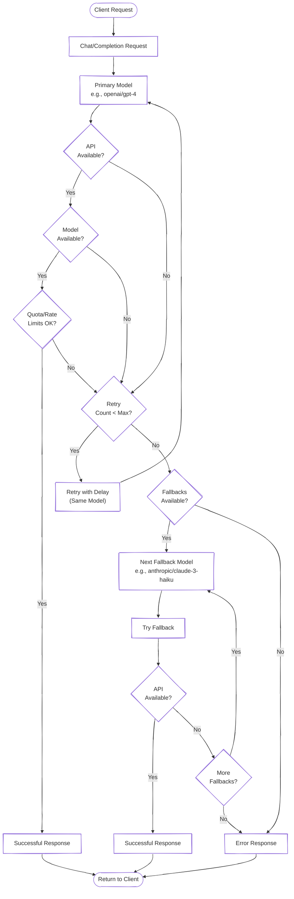

# Advanced Features

This guide covers advanced features and configurations in OneLLM, including fallback mechanisms, retry strategies, semantic caching, and working with multiple providers.

## Semantic Caching

OneLLM includes intelligent semantic caching to reduce API costs and improve response times. For complete documentation, see [Semantic Caching]({{ site.baseurl }}/caching.md).

**Quick example:**
```python
import onellm

# Enable cache
onellm.init_cache()

# Responses are now cached automatically
response = ChatCompletion.create(...)  # API call + cached
response = ChatCompletion.create(...)  # Instant from cache
```

**Key benefits:**
- 50-80% cost reduction during development
- Instant response for cached queries
- Multilingual support (50+ languages)
- Zero ongoing costs (local embeddings)

[→ Full caching documentation]({{ site.baseurl }}/caching.md)

## Fallback Mechanism

OneLLM provides intelligent fallback between providers when failures occur. This ensures high availability and resilience in production environments.

### Basic Fallback

Use multiple models in order of preference:

```python
from onellm import ChatCompletion

# Fallback chain: try each model in order
response = ChatCompletion.create(
    model="openai/gpt-4",
    messages=[{"role": "user", "content": "Hello!"}],
    fallback_models=[
        "anthropic/claude-3-opus",
        "google/gemini-pro"
    ]
)
```

### Provider-Specific Fallback

Mix models from different providers:

```python
from onellm import ChatCompletion

# Production-ready fallback strategy
response = ChatCompletion.create(
    model="openai/gpt-4-turbo",  # Primary model
    messages=[{"role": "user", "content": "Analyze this data..."}],
    fallback_models=[
        "anthropic/claude-3-opus",   # Fallback 1: Different provider
        "openai/gpt-3.5-turbo",     # Fallback 2: Same provider, cheaper
        "ollama/llama2"             # Fallback 3: Local model
    ]
)
```

### Conditional Fallback

Fallback only occurs when specific errors happen:

- **Rate Limits**: Automatically switches to next provider
- **Service Unavailable**: Tries alternative providers
- **Authentication Errors**: Skips to next (won't retry)
- **Invalid Model**: Moves to next available model

### Fallback Events

Monitor fallback events:

```python
import logging
from onellm import ChatCompletion

logging.basicConfig(level=logging.INFO)

# OneLLM logs fallback attempts
response = ChatCompletion.create(
    model="openai/gpt-4",
    messages=[{"role": "user", "content": "Hello!"}],
    fallback_models=["anthropic/claude-3-opus"]
)

# Logs will show:
# INFO: Attempting openai/gpt-4...
# WARNING: openai/gpt-4 failed: Rate limit exceeded
# INFO: Falling back to anthropic/claude-3-opus...
# INFO: Successfully used anthropic/claude-3-opus
```

## Retry Configuration

Control how OneLLM retries failed requests.

### Max Retries

For transient errors, OneLLM can retry the same model multiple times before falling back:

```python
from onellm import ChatCompletion

# Configure retries per request
response = ChatCompletion.create(
    model="openai/gpt-4",
    messages=[{"role": "user", "content": "Hello!"}],
    retries=3,  # Will try the same model up to 3 additional times if it fails
    fallback_models=["anthropic/claude-3-haiku", "openai/gpt-3.5-turbo"]
)
```

### Retry Delays

OneLLM uses exponential backoff with jitter:

```python
# Retry delays (approximately):
# Attempt 1: Immediate
# Attempt 2: ~1 second
# Attempt 3: ~2 seconds
# Attempt 4: ~4 seconds
# Attempt 5: ~8 seconds
```

### Custom Retry Logic

Implement custom retry behavior:

```python
from onellm import ChatCompletion
from onellm.errors import RateLimitError
import time

def custom_retry(func, max_attempts=3):
    for attempt in range(max_attempts):
        try:
            return func()
        except RateLimitError as e:
            if attempt < max_attempts - 1:
                wait_time = min(2 ** attempt, 60)  # Exponential backoff
                print(f"Rate limited, waiting {wait_time}s...")
                time.sleep(wait_time)
            else:
                raise

# Use with custom logic
response = custom_retry(
    lambda: ChatCompletion.create(
        model="openai/gpt-4",
        messages=[{"role": "user", "content": "Hello!"}]
    )
)
```

## Fallback and Retry Architecture

Here's how OneLLM handles failures, retries, and fallbacks internally:



This flow ensures maximum reliability by:
1. Retrying transient failures with exponential backoff
2. Falling back to alternative models when retries are exhausted
3. Trying multiple fallback options in sequence
4. Returning detailed error information when all options fail

## Working with Local Models

OneLLM supports local models through Ollama and llama.cpp providers.

### Using Ollama

Configure Ollama endpoint:

```python
from onellm import ChatCompletion
import os

# Set Ollama base URL if not using default
os.environ["OLLAMA_BASE_URL"] = "http://localhost:11434"

# Use Ollama models
response = ChatCompletion.create(
    model="ollama/llama2",
    messages=[{"role": "user", "content": "Hello!"}]
)
```

### Using llama.cpp

For direct GGUF model execution:

```python
from onellm import ChatCompletion
import os

# Set path to your GGUF model
os.environ["LLAMA_CPP_MODEL_PATH"] = "/path/to/model.gguf"

# Use llama.cpp provider
response = ChatCompletion.create(
    model="llama_cpp/model",
    messages=[{"role": "user", "content": "Hello!"}]
)
```

## Streaming with Fallback

Combine streaming with fallback for resilient real-time responses:

```python
from onellm import ChatCompletion

stream = ChatCompletion.create(
    model="openai/gpt-4",
    messages=[{"role": "user", "content": "Write a story..."}],
    fallback_models=["anthropic/claude-3-opus"],
    stream=True
)

# If streaming fails mid-response, OneLLM can:
# 1. Continue with the partial response
# 2. Restart with fallback model
# 3. Merge responses intelligently

for chunk in stream:
    if chunk.choices[0].delta.content:
        print(chunk.choices[0].delta.content, end="")
```

## Request Timeout Configuration

Control timeouts through environment variables:

```python
from onellm import ChatCompletion
import os

# Set timeout via environment variable
os.environ["ONELLM_TIMEOUT"] = "60"  # 60 seconds

# Make request with configured timeout
response = ChatCompletion.create(
    model="openai/gpt-4",
    messages=[{"role": "user", "content": "Hello!"}]
)
```

## Concurrent Requests

Handle multiple requests efficiently:

```python
import asyncio
from onellm import ChatCompletion

async def process_many():
    # Process multiple requests concurrently
    tasks = []
    for i in range(10):
        task = ChatCompletion.acreate(
            model="openai/gpt-3.5-turbo",
            messages=[{"role": "user", "content": f"Request {i}"}],
            fallback_models=["anthropic/claude-3-haiku"]
        )
        tasks.append(task)

    # Wait for all to complete
    responses = await asyncio.gather(*tasks)
    return responses

# Run concurrent requests
responses = asyncio.run(process_many())
```

## JSON Mode

For structured outputs, OneLLM supports JSON mode with compatible providers:

```python
from onellm import ChatCompletion
import json

response = ChatCompletion.create(
    model="openai/gpt-4o",
    messages=[
        {"role": "user", "content": "List the top 3 programming languages with their key features"}
    ],
    response_format={"type": "json_object"}  # Request JSON output
)

# The response contains valid, parseable JSON
json_response = response.choices[0].message["content"]
structured_data = json.loads(json_response)
```

## Logging and Monitoring

Enable logging to monitor OneLLM operations:

```python
import logging

# Configure logging
logging.basicConfig(
    level=logging.INFO,
    format='%(asctime)s - %(name)s - %(levelname)s - %(message)s'
)

# OneLLM will log:
# - Provider selection
# - Retry attempts
# - Fallback decisions
# - Errors and warnings
```

## Environment Variables

OneLLM supports configuration through environment variables:

```python
import os

# Set API keys
os.environ["OPENAI_API_KEY"] = "sk-..."
os.environ["ANTHROPIC_API_KEY"] = "sk-ant-..."

# Set timeouts
os.environ["ONELLM_TIMEOUT"] = "60"

# Set Ollama endpoint
os.environ["OLLAMA_BASE_URL"] = "http://localhost:11434"

# Set llama.cpp model path
os.environ["LLAMA_CPP_MODEL_PATH"] = "/path/to/model.gguf"
```

## Best Practices

### 1. **Always Use Fallbacks in Production**
```python
# Bad: Single point of failure
response = ChatCompletion.create(
    model="openai/gpt-4",
    messages=messages
)

# Good: Multiple fallback options
response = ChatCompletion.create(
    model="openai/gpt-4",
    messages=messages,
    fallback_models=["anthropic/claude-3-opus", "openai/gpt-3.5-turbo"]
)
```

### 2. **Configure Appropriate Timeouts**
```python
import os

# Set reasonable timeout via environment
os.environ["ONELLM_TIMEOUT"] = "30"  # 30 seconds

# Make requests with configured timeout
response = ChatCompletion.create(
    model="openai/gpt-3.5-turbo",
    messages=messages
)
```

### 3. **Monitor and Log Failures**
```python
import logging

# Enable logging to track issues
logging.basicConfig(level=logging.INFO)
logger = logging.getLogger("onellm")

# Logs will show fallback attempts and errors
```

### 4. **Use Local Models for Development**
```python
# Development: Use local models
dev_model = "ollama/llama2"

# Production: Use cloud providers with fallbacks
prod_model = "openai/gpt-4"
prod_fallbacks = ["anthropic/claude-3-opus", "openai/gpt-3.5-turbo"]
```

### 5. **Handle Errors Gracefully**
```python
from onellm import ChatCompletion
from onellm.errors import OneLLMError

try:
    response = ChatCompletion.create(
        model="openai/gpt-4",
        messages=messages,
        fallback_models=["anthropic/claude-3-opus"]
    )
except OneLLMError as e:
    # Handle OneLLM-specific errors
    logger.error(f"LLM request failed: {e}")
    # Use a default response or retry later
```

## Next Steps

- [Provider Capabilities]({{ site.baseurl }}/providers/capabilities.md) - Compare provider features
- [Error Handling]({{ site.baseurl }}/error-handling.md) - Handle errors gracefully
- [Best Practices]({{ site.baseurl }}/guides/best-practices.md) - Production recommendations
