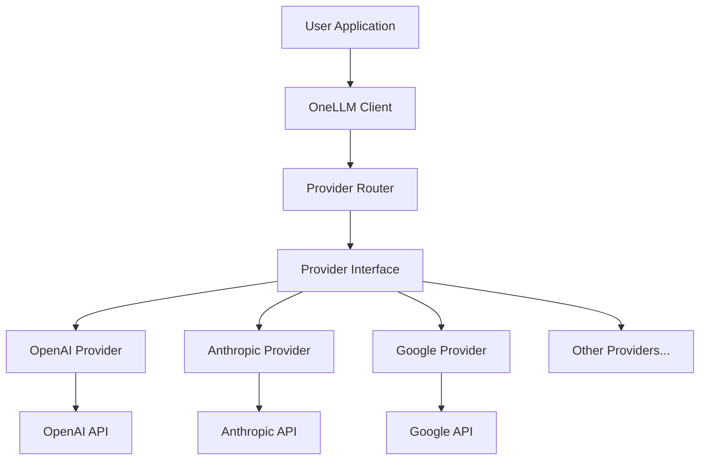

# Architecture

This document explains the internal architecture and design principles of OneLLM.

## Overview

OneLLM is designed as a unified interface for multiple LLM providers, offering a consistent API that matches OpenAI's client interface while supporting 18+ different providers.



## Core Components

### 1. Client Layer (`onellm/client.py`)

The main entry point that provides OpenAI-compatible interface:

```python
class OpenAI:
    def __init__(self, **kwargs):
        # Initialize with configuration
        self.chat = Chat(self)
        self.completions = Completions(self)
        self.embeddings = Embeddings(self)
        # ... other endpoints
```

**Key Features:**
- Drop-in replacement for OpenAI client
- Automatic provider detection from model names
- Unified error handling
- Both sync and async support

### 2. Provider System (`onellm/providers/`)

#### Base Provider (`base.py`)

Abstract base class that all providers implement:

```python
class Provider(ABC):
    # Capability flags
    json_mode_support = False
    vision_support = False
    streaming_support = True

    @abstractmethod
    async def create_chat_completion(self, messages, model, **kwargs):
        """Create a chat completion."""
        pass
```

#### Provider Registry

Dynamic provider discovery and registration:

```python
# Providers register themselves
register_provider("openai", OpenAIProvider)
register_provider("anthropic", AnthropicProvider)

# Router selects provider based on model name
provider = get_provider("anthropic/claude-3")
```

### 3. Model Naming Convention

Models use the format: `provider/model-name`

Examples:
- `openai/gpt-4o-mini`
- `anthropic/claude-3-5-sonnet-20241022`
- `google/gemini-1.5-flash`

### 4. API Compatibility Layer

#### Request Translation

Each provider translates OpenAI format to native format:

```python
# OpenAI format (input)
messages = [
    {"role": "system", "content": "You are helpful"},
    {"role": "user", "content": "Hello"}
]

# Provider translates to native format
# e.g., Anthropic format
native_messages = provider.translate_messages(messages)
```

#### Response Normalization

Providers normalize responses back to OpenAI format:

```python
# Native provider response
native_response = {"text": "Hello!", "model": "claude-3"}

# Normalized to OpenAI format
openai_response = {
    "choices": [{
        "message": {"role": "assistant", "content": "Hello!"},
        "finish_reason": "stop"
    }],
    "model": "anthropic/claude-3"
}
```

## Design Patterns

### 1. Factory Pattern

Provider creation through factory:

```python
def get_provider(model: str) -> Provider:
    provider_name = parse_provider_name(model)
    provider_class = PROVIDER_REGISTRY[provider_name]
    return provider_class()
```

### 2. Adapter Pattern

Each provider adapts native API to common interface:

```python
class AnthropicProvider(Provider):
    def create_chat_completion(self, messages, model, **kwargs):
        # Adapt to Anthropic API
        anthropic_request = self._to_anthropic_format(messages)
        anthropic_response = self._call_anthropic_api(anthropic_request)
        return self._to_openai_format(anthropic_response)
```

### 3. Strategy Pattern

Different strategies for different capabilities:

```python
if provider.streaming_support:
    return provider.create_streaming_completion()
else:
    return provider.create_completion()
```

### 4. Proxy Pattern

Fallback provider acts as proxy:

```python
class FallbackProvider(Provider):
    def __init__(self, providers):
        self.providers = providers

    async def create_chat_completion(self, **kwargs):
        for provider in self.providers:
            try:
                return await provider.create_chat_completion(**kwargs)
            except Exception:
                continue
        raise AllProvidersFailedError()
```

## Error Handling

### Error Hierarchy

```
OneLLMError
├── APIError
│   ├── AuthenticationError
│   ├── RateLimitError
│   ├── InvalidRequestError
│   └── ServiceUnavailableError
├── ConfigurationError
└── ProviderError
```

### Error Translation

Providers translate native errors to common errors:

```python
def _handle_error(self, native_error):
    if "authentication" in str(native_error):
        raise AuthenticationError(...)
    elif "rate_limit" in str(native_error):
        raise RateLimitError(...)
```

## Async Architecture

### Async Client

```python
class AsyncOpenAI:
    async def create_chat_completion(self, **kwargs):
        provider = self._get_provider(kwargs["model"])
        return await provider.create_chat_completion(**kwargs)
```

### Connection Pooling

```python
class Provider:
    def __init__(self):
        self.session = None

    async def _ensure_session(self):
        if not self.session:
            self.session = aiohttp.ClientSession()
```

## Configuration System

### Configuration Loading

```python
# 1. Default configuration
config = DEFAULT_CONFIG

# 2. Environment variables
config.update(load_env_vars())

# 3. Runtime configuration
config.update(user_config)
```

### Provider Configuration

```python
PROVIDER_CONFIG = {
    "openai": {
        "api_key": None,
        "api_base": "https://api.openai.com/v1",
        "timeout": 60
    }
}
```

## Type System

### Type Definitions

```python
from typing import TypedDict, Literal

class Message(TypedDict):
    role: Literal["system", "user", "assistant"]
    content: str

class ChatCompletionResponse(TypedDict):
    id: str
    model: str
    choices: List[Choice]
    usage: Usage
```

### Runtime Validation

```python
def validate_messages(messages: List[Message]):
    for message in messages:
        if "role" not in message:
            raise ValueError("Message missing role")
```

## Performance Optimizations

### 1. Lazy Loading

Providers are loaded only when needed:

```python
_PROVIDER_INSTANCES = {}

def get_provider(name: str) -> Provider:
    if name not in _PROVIDER_INSTANCES:
        _PROVIDER_INSTANCES[name] = _create_provider(name)
    return _PROVIDER_INSTANCES[name]
```

### 2. Connection Reuse

HTTP connections are reused:

```python
class Provider:
    _session = None

    @classmethod
    async def get_session(cls):
        if not cls._session:
            cls._session = aiohttp.ClientSession()
        return cls._session
```

### 3. Response Streaming

Efficient streaming for large responses:

```python
async def stream_response(self):
    async with session.post(url) as response:
        async for chunk in response.content:
            yield self._parse_chunk(chunk)
```

## Extension Points

### Adding New Providers

1. Create provider class:
```python
class NewProvider(Provider):
    json_mode_support = True

    async def create_chat_completion(self, ...):
        # Implementation
```

2. Register provider:
```python
register_provider("newprovider", NewProvider)
```

### Adding New Capabilities

1. Add capability flag:
```python
class Provider:
    new_capability_support = False
```

2. Implement in providers that support it:
```python
class AdvancedProvider(Provider):
    new_capability_support = True

    def use_new_capability(self):
        # Implementation
```

## Security Considerations

### API Key Protection

- Keys never logged
- Keys loaded from environment
- Keys isolated per provider

### Request Sanitization

- Input validation
- Size limits
- Rate limiting

### Response Validation

- Schema validation
- Content filtering
- Error sanitization

## Testing Architecture

### Unit Tests

```python
def test_provider_creation():
    provider = get_provider("openai")
    assert isinstance(provider, OpenAIProvider)
```

### Integration Tests

```python
@pytest.mark.integration
async def test_real_api_call():
    client = OpenAI()
    response = await client.chat.completions.create(...)
    assert response.choices[0].message
```

### Mock Testing

```python
@patch("onellm.providers.openai.aiohttp.ClientSession")
def test_with_mock(mock_session):
    # Test without real API calls
```

## Future Architecture

### Planned Enhancements

1. **Plugin System**: Dynamic provider loading
2. **Middleware**: Request/response interceptors
3. **Caching**: Response caching layer
4. **Metrics**: Performance monitoring
5. **Load Balancing**: Across provider instances

### Extensibility

The architecture is designed to be extensible:
- New providers can be added without changing core
- New capabilities can be added incrementally
- Backward compatibility is maintained

## Next Steps

- [Provider System](providers/README.md) - Detailed provider documentation
- [API Reference](api/client.md) - API documentation
- [Contributing](../CONTRIBUTING.md) - How to extend OneLLM
